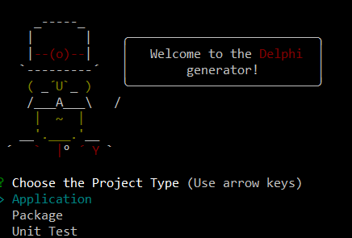

# Yo Delphi
> Yeoman generator for Delphi projects

[![NPM version][npm-image]][npm-url] 
<!-- [![Build Status][travis-image]][travis-url] [![Dependency Status][daviddm-image]][daviddm-url] -->

```
yo delphi
```

This generator will help you start with a range of **Delphi** projects, right from the command line.

## Getting Started

* Make sure you have [node.js](https://nodejs.org/) and [Yeoman](http://yeoman.io) installed
* Install the generator: 
```bash
npm install -g generator-delphi`
```
* Run the generator: 
```bash
yo delphi
```



## Features

The generator will create complete projects, ready to compile and run.

These are the available projects:

```
├── Aplication
│   ├── Console
│   └── VCL Forms
├── Package
│   ├── Runtime
│   ├── Designtime
│   └── Runtime and Designtime
└── Unit Test
    ├── Console
    └── GUI
```

There are some specific options for each kind of project, which you will be able to choose/type while using the generator

## Participate

If you have any idea, feel free to create issues and pull requests

## License

MIT © [Alessandro Fragnani](https://www.github.com/alefragnani)

---

[](https://www.paypal.com/cgi-bin/webscr?cmd=_donations&business=EP57F3B6FXKTU&lc=US&item_name=Alessandro%20Fragnani&item_number=vscode%20extensions&currency_code=USD&bn=PP%2dDonationsBF%3abtn_donate_SM%2egif%3aNonHosted) a :coffee: and you will help me to keep working on this extension :wink:

[](https://www.paypal.com/cgi-bin/webscr?cmd=_donations&business=EP57F3B6FXKTU&lc=BR&item_name=Alessandro%20Fragnani&item_number=vscode%20extensions&currency_code=BRL&bn=PP%2dDonationsBF%3abtn_donate_SM%2egif%3aNonHosted) um :coffee: e você vai me ajudar a continuar trabalhando nesta extensão :wink:

[npm-image]: https://badge.fury.io/js/generator-delphi.svg
[npm-url]: https://npmjs.org/package/generator-delphi
[travis-image]: https://travis-ci.org/alefragnani/generator-delphi.svg?branch=master
[travis-url]: https://travis-ci.org/alefragnani/generator-delphi
[daviddm-image]: https://david-dm.org/alefragnani/generator-delphi.svg?theme=shields.io
[daviddm-url]: https://david-dm.org/alefragnani/generator-delphi
